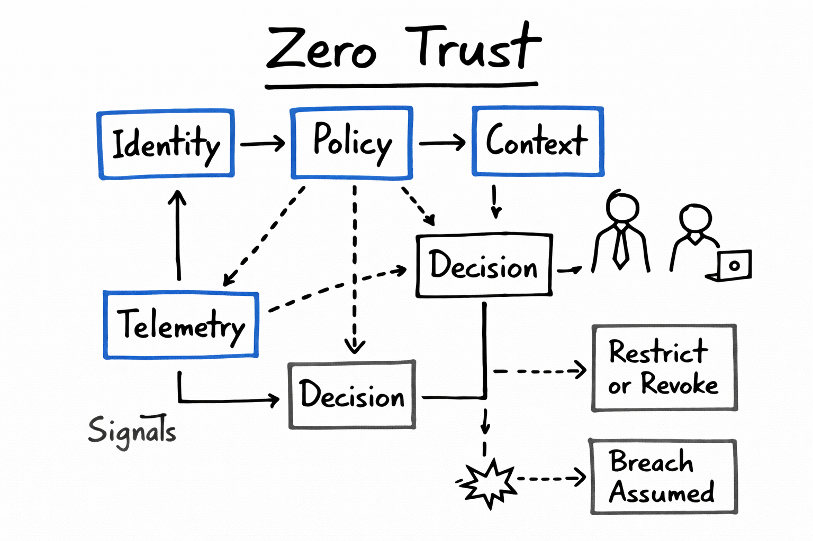

# Phase 3 — Zero Trust Architecture (Interview Whiteboard)

## Canonical Interview Diagram

This is the **single authoritative interview whiteboard diagram** for Phase 3 — Zero Trust Architecture.

All interview explanations, whiteboard walkthroughs, and senior-level discussions
should reference this diagram.

These diagrams are intentionally:

- Vendor-neutral
- Architecture-first
- Whiteboard-explainable
- Suitable for senior / principal interviews

---

## Canonical Zero Trust Control Loop

### How to Explain This Diagram in an Interview

1. **Identity**
   - Who is requesting access (human, workload, service)
   - Authentication ≠ authorization

2. **Policy**
   - What this identity is allowed to do
   - Least-privilege, intent-based rules

3. **Context**
   - Conditions surrounding the request
   - Environment, device posture, risk signals

4. **Decision**
   - Access is granted, limited, or denied
   - Decisions are **continuous**, not one-time

5. **Telemetry**
   - Identity events, network flow logs, behavior signals
   - Feeds back into future decisions

6. **Enforcement**
   - Access can be restricted or revoked at any time
   - Breach is assumed by default

---

## Why This Is Zero Trust

- No implicit network trust
- No permanent access paths
- Identity and signals drive enforcement
- Continuous verification replaces static access

This diagram directly supports:

- Lab 3.1 — Identity-Aware Access
- Lab 3.2 — Zero Trust Network Segmentation
- Lab 3.3 — Context & Conditional Trust
- Lab 3.4 — Telemetry-Driven Enforcement
